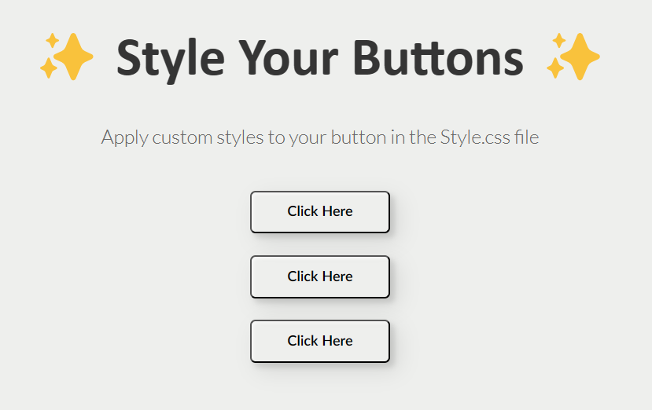

# Project Description 
This project showcases the CSS skills we development in our third week at Codespace. Shown in this repo are custom-styled buttons using CSS, featuring various styles and effects. 

# Changes made 
## Metallic Pink Button
 This button has a metallic gradient background. On hover, the background changes to pink, and the border color adjusts. I love the metallic effect and the smooth hover transition, which make this button visually appealing.
## Neon Purple Button
This button sports a neon purple background with yellow text and borders. Hovering makes the background transparent, enhancing the neon effect.
## Blue-Orange Gradient Button
This button has a gradient from blue to orange and rotates 360 degrees when hovered over. The rotation effect on hover adds a unique and dynamic element to the button, making it the most challenging and my favorite part of the project.

# Challenges
I struggled with time management and making effective use of the starter code. However, I achieved the desired outcomes and created buttons that I'm particularly proud of and i hope that they meet the requirements.

# [SDF05] CSS Magic Buttons

Get ready to create animated buttons using CSS! This project focuses on creating three unique animated buttons using CSS. With this challenge, you'll dive into the world of CSS animations, transitions, and interactivity.

## Learning Goals

By completing this project, you will learn to:

- Design engaging button animations with CSS.
- Master the use of CSS transitions and animations for interactive effects.

## Project Overview

### Time Estimate: 2 hours

## What you Need to Do:

1. **Starter Code**: Clone the starter code from GitHub for your project. The HTML structure is provided, and you'll focus on adding styles in the `style.css` file.

    - Starter code can be found here: https://github.com/CodeSpace-Academy/Module_5R_StudentNo_Classcode_Group_Name-Surname_SDF05R

2. **Write your CSS Styles**: Create your animations from scratch. Need a hint of inspiration? You're welcome to go through our curated buttons for inspiration: [View Reference](https://codepen.io/codespace-academy/pen/xxmWrjX). 

3. **Prepare Your Repository**: 
    - Save all chanes and update your GitHub repository with the final versions of all files.
    - Include a `README.md` file that outlines the project, your design choices, and any notes on challenges you faced or features you're particularly proud of.
    - Ensure your repository is set to public so it can be accessed by your code coach.

4. **Submit on LMS**:
    - Submit the link to your GitHub repository on the LMS under the project tab.

Embark on this CSS journey to transform simple buttons into interactive, animated elements. Let your creativity shine and enjoy the process of bringing static elements to life!

## Submission Guidelines
- Submit the link to your GitHub repository on the LMS under the project tab.

Embark on this CSS journey to transform simple buttons into interactive, animated elements. Let your creativity shine and enjoy the process of bringing static elements to life!
